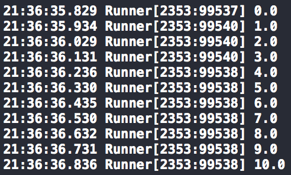
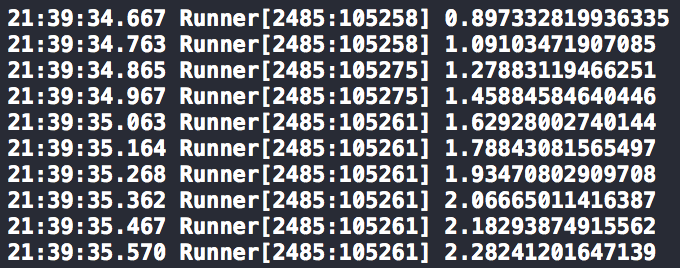

# Runner

[](https://travis-ci.org/lucianomarisi/Runner)
[](https://cocoapods.org/pods/Runner)
[](http://codecov.io/github/lucianomarisi/Runner?branch=master)

Easily execute a block at specific time intervals.

## Installation

Either

- Use [CocoaPods](http://cocoapods.org):

	`pod 'Runner'`

OR

- Add the files inside the `Runner` folder to your project

## Examples

### Execute a predefined set of points

```swift
// Generate some points
var mockPoints = [Point]()
let numberOfPoints = 10
let totalTime = 1.0
for index in 0...numberOfPoints {
  let timestamp = NSTimeInterval(index) * totalTime / Double(numberOfPoints)
  let mockPoint = Point(timestamp: timestamp, value: Double(index))
  mockPoints.append(mockPoint)
}

// Execute blocks at the times from the mocked points
let runner = Runner()
runner.startWithMockPoints(mockPoints) { (point) -> Void in
  NSLog("\(point.value)")
}
```

This will produce the following logs:



### Execute points using a function

```swift

// Define function to generate points
func sineSignal(nextTimestamp: NSTimeInterval) -> Point {
  let signalFrequency = 1.0
  let amplitude = 2.0
  let offset = 0.5
  let phaseShift = 0.2
  let value = amplitude * sin(nextTimestamp * signalFrequency + phaseShift) + offset
  return Point(timestamp: nextTimestamp, value: value)
}

let runner = Runner()
// Start executing points
runner.startWithFunction(sineSignal) { (point) -> Void in
  NSLog("\(point.value)")
}

// Stop executing points
runner.stop()
```

This will produce the following logs:

